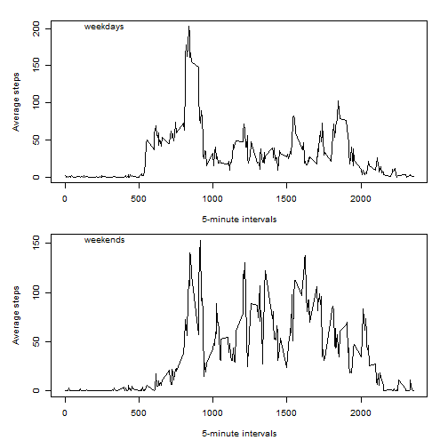

# Reproducible Research: Peer Assessment 1

## Loading and preprocessing the data

```r
data <- read.csv(unz("activity.zip", "activity.csv"), colClasses = c("numeric",                                                               "character", "numeric"))
```

`dplyr` and `timeDate` packages are necessary.


```r
Sys.setlocale("LC_TIME","English_United States.1252")
```

```
## [1] "English_United States.1252"
```

```r
Sys.setenv(TZ='GMT')
library(dplyr)
```

```
## 
## Attaching package: 'dplyr'
## 
## Ñëåäóşùèå îáúåêòû ñêğûòû from 'package:stats':
## 
##     filter, lag
## 
## Ñëåäóşùèå îáúåêòû ñêğûòû from 'package:base':
## 
##     intersect, setdiff, setequal, union
```

```r
library(timeDate)
```

## What is mean total number of steps taken per day?

Preparing data for further calculations and plotting:

```r
data1 <- data %.%
    group_by(date) %.%
    summarise(total = sum(steps))
hist(data1$total, main = "Histogram of the total number of steps per day",
     xlab = "total number of steps taken each day")
```

 

Mean and median:

```r
mean(data1$total, na.rm = T) -> tstepsmean
print(tstepsmean)
```

```
## [1] 10766
```
The mean total number of steps taken per day is 1.0766 &times; 10<sup>4</sup>.

```r
median(data1$total, na.rm = T) -> tstepsmedian
print(tstepsmedian)
```

```
## [1] 10765
```
The median total number of steps taken per day is 1.0765 &times; 10<sup>4</sup>.  

## What is the average daily activity pattern?

*1. Make a time series plot of the 5-minute interval and the average number of steps.*


```r
data2 <- data %.%
    group_by(interval) %.%
    summarise(mean = mean(steps, na.rm = T))
plot(data2$interval, data2$mean, type = "l", main = "Time Series Plot per
     5-minute interval", xlab = "5-minute intervals", ylab = "Average number of
     steps taken")
```

 

*2. Which 5-minute interval, on average across all the days in the dataset, contains*
*the maximum number of steps?*


```r
data2[which.max(data2$mean), "interval"]
```

```
## [1] 835
```

## Imputing missing values

*1. Calculate and report the total number of missing values in the dataset (i.e.*
*the total number of rows with NAs)*


```r
sum(is.na(data$steps))
```

```
## [1] 2304
```

*2. Devise a strategy for filling in all of the missing values in the dataset.*
*The strategy does not need to be sophisticated. For example, you could use the*
*mean/median for that day, or the mean for that 5-minute interval, etc.*

The strategy will be to fill the missing values with the value of previous 5-minute
interval, the interval 0 will have 0 steps if it has NA value

*3. Create a new dataset that is equal to the original dataset but with the missing*
*data filled in.*


```r
new.data <- data

if ( is.na(data[1, "steps"]) ) {
    new.data[1, "steps"] <- 0
}

for(row.idx in 2:length(data$steps)) {
    if ( is.na(data[row.idx, "steps"]) ) {
        new.data[row.idx, "steps"] <- new.data[(row.idx - 1), "steps"]
    }
}
```

*4. Make a histogram of the total number of steps taken each day*


```r
new.data1 <- new.data %.%
    group_by(date) %.%
    summarise(total = sum(steps))
hist(new.data1$total, main = "Histogram of the total number of steps per day",
     xlab = "total number of steps taken each day")
```

 

*5. Calculate and report the mean and median total number of steps taken per day*

```r
mean(new.data1$total) -> new.tstepsmean
print(new.tstepsmean)
```

```
## [1] 9354
```
The mean total number of steps taken per day is 9354.2295.

```r
median(new.data1$total) -> new.tstepsmedian
print(new.tstepsmedian)
```

```
## [1] 10395
```
The median total number of steps taken per day is 1.0395 &times; 10<sup>4</sup>.  

## Are there differences in activity patterns between weekdays and weekends?

*1. Create a new factor variable in the dataset with two levels – “weekday” and*
*weekend” indicating whether a given date is a weekday or weekend day.*


```r
new.data$date <- as.Date(new.data$date, tz = "GMT")
library(timeDate)

for (row.idx in 1:length(new.data$date)) {
    if(isWeekday(new.data[row.idx, "date"])) {
        new.data[row.idx, "weekday"] <- "weekday"
    } else {
        new.data[row.idx, "weekday"] <- "weekend"
    }
}
new.data$weekday <- factor(new.data$weekday)
```

*2. Make a panel plot containing a time series plot (i.e. type = "l") of the 5-minute*
*interval (x-axis) and the average number of steps taken, averaged across all weekday*
*days or weekend days (y-axis).*


```r
# Making 2 data frames for weekdays and weekends
new.data.weekdays <- new.data %.%
    filter(weekday == "weekday") %.%
    group_by(interval) %.%
    summarise(mean = mean(steps))

new.data.weekends <- new.data %.%
    filter(weekday == "weekend") %.%
    group_by(interval) %.%
    summarise(mean = mean(steps))
```


```r
# Ploting
par(mfrow = c(2,1))
plot(new.data.weekdays$interval, new.data.weekdays$mean, type = "l", main = "Time Series Plot per
     5-minute interval (weekdays)", xlab = "5-minute intervals", ylab = "Average steps")

plot(new.data.weekends$interval, new.data.weekends$mean, type = "l", main = "Time Series Plot per
     5-minute interval (weekends)", xlab = "5-minute intervals", ylab = "Average steps")
```

 

